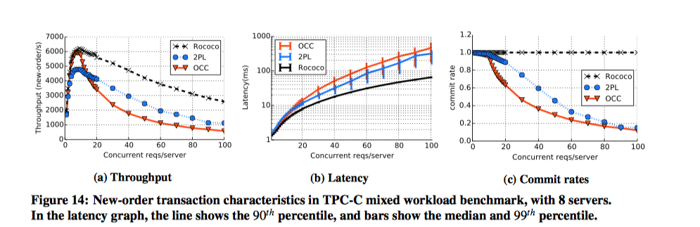
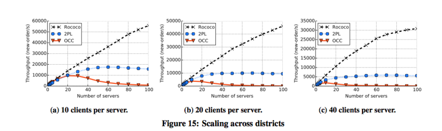

#Rococo：为分布式系统提高并发性的新协议

-	论文：Extracting More Concurrency from Distributed Transactions

- 	方向：分布式事务系统一致性与并发性的保证。
-	这篇论文围绕着在分布式系统中、乃至整个计算机系统中一个很重要、同时也是一个很棘手的问题进行讨论——如何保证两个同时发生的冲突事件可以正常运行。作者设计出了一个新的协议Rococo，来处理分布式的冲突交易，并讲述了Rococo的实现思路，理论支撑，以及他的性能。

##基本背景
-	随着网络交易规模的壮大，分布式事务处理变得越来越重要。而分布式事务处理的并发性这一个特征也越来越明显。尤其是在网络越来越发达的情况下，越来越多的人会依赖于网购，机票预订、商品抢购，如果我们没有一个足以高效的机制来应对分布式事务的并发冲突，不能保证他们的并发性以及一致性，那么就无法支撑如此高速发展的互联网交易。论文中也有提到，传统的分布式事务处理协议中就有2PL和OCC两种。但是这俩个协议的效率由于会不断的中断阻塞事务处理，所以在处理并发事务这一方面效率并不是很高。
- 在分布式事务处理这方面中，现在主流的协议是2PL和OCC两种协议。

	- OCC:OCC处理事务时, 会给事务赋予时间戳, 以确定事务调度次序. 首先先读取数据库, 修改数据的私有副本; 根据事务的时间戳和数据依赖做冲突检测(conflict detection或validation); 有冲突则选择rollback和restart; 无冲突则安装修改过的私有副本到数据库中。
	
	- 2PL：2PL处理事务时，有点类似于我们的多进程管理，每次使用相同的变量时，都需要加锁。2PL在所有的读写操作之前均需加锁，解锁之后不允许出现加锁操作。

##基本介绍
###什么是分布式事务处理？
-	分布式事务处理，是指在分布式系统上的每一项交易都必须在所有的分布式节点上进行更新，为了保证这一点，其中最大的难处就是保证交易的原子性，也就是说当交易成功时，该值必须在所有的节点服务器上更新，若失败就需要在所有的节点上进行回流，不能出现只在一台服务器更新，而其他不更新的情况。为了保证这一点，传统的处理分布式交易方式都是基于2PL和OCC两种方式。

###解决方法

-	当交易互相冲突时，2PL会将两个交易加锁、串行化，而OCC则会中断程序并重新执行相应的程序。诚然，在工作负荷较小的情况下，这俩种方式是足以解决并发的冲突事务的，但是当工作负荷较大情况下，这两种方式的效率会不断降低，系统性能无法得到保证。

-	而Rococo，则是将交易当作原子操作集合，服务器集群会首先将同时发生的交易收集起来，获取他们的依赖关系，然后在约定的时间，将交易的依赖关系分发给所有的节点，重排交易次序，然后串行处理并发冲突事务。基于这种实现思路，Rococo的性能在工作负荷较高的情况下比其他两种方式好。

###现实意义
-	我们在现实生活中，通常会有大量的并发性的冲突事务发生。举个例子，每年双十一，大家都会到淘宝上抢购折扣商品，这个时候就是冲突事务高发的时间。比如1000个消费者同时抢购100双同样的鞋子，整个时候我们就必须既保证速度有保证正确性的将购买结果结果反馈给消费者，同时也不能因为服务器超负荷而导致整个网站奔溃。所以Rococo协议的出现是非常具有现实意义的。

##三种方式实现的比较
-	接下来，我们根据作者的思路来简要的介绍传统协议的实现以及Rococo协议的实现，并从实现上面来分析Rococo性能提高的原因。

###2PC 和 OCC
-	在OCC执行非序列化交叉片段的过程中，如果有另一个任务插入时，OCC协议系统就会被打断，最后导致两个任务都失败，而必须重新处理。

- 	对于2PL，它会在每一个数据访问时对数据加锁，而除了阻塞冲突进程之外，2PL也会通过中断去防止死锁发生，但是一些比较高效的死锁防护机制会经常在没有死锁的时候，产生中断。一中断，正在处理的事务就必须重新进行处理。

###Rococo
####基本思路
-	Rococo协议使用双周期消息提交制度来处理事务，服务器使用依赖关系信息来检测交易之间是否干扰并确定性地重新排列事务，以便交易能在所有服务器上以相同的顺序执行，而不发生干扰。

-	Rococo协议使用俩种关键技术来实现安全的交叉存取，一个是跟踪时间之间的依赖性，延缓并重排交易处理，另一个是基于碎片化交易理论的离线安全检查。

####具体实现介绍
-	作者首先介绍了离线安全检查的实现（offline checker）。
	- offline checker确定是否可以在运行时正确的重新排列事务集合的各个部分。Offline checker为了确定交易是否可以重新排序，使用了SC图，在图中，每一个顶点代表着一个交易事务，来自同一个交易的俩个事务之间使用S边进行连接，而俩个冲突事务之间则使用C边连接，如果在图中的一个环里同时存在S边和C边，则它是一个SC周期，每一个SC周期发出一个可能导致不可序列化执行的潜在冲突。Offline checker就是通过将C边边缘的任何事务标签更改为I事务，并在该点传播即时性，知道将C边消除。然后就检查是否存在所有C边都是I-I变得不可修复的SC循环，若没有，offline checker就会认为可以安全地对所有冲突进行重排，对于那些被认为不可重排的SC图，offline checker会建议把属于同一交易的环中的那些事务合并为更大的原子事务，这一部分就会通过传统协议来执行。

-	当offline checker得到了冲突重排的可能性之后，runtime protocol就会开始执行一系列任务。在这个环节中，会由coordinators和servers来同时处理。Coordinator收集客户的交易请求，然后分为两个阶段来处理交易：start和commit。
	-	在start阶段，coordinator将事务发送到服务器并收集由服务器返回的依赖关系。这个阶段也是通过在服务器构建一个关系依赖图来维护事务之间的依赖关系的，如果在这个过程中，服务器收到可延迟的事务时，会将其缓存以供稍后执行，若服务器如果看到immediate事务，就马上处理。最后将依赖图发送给coordinator。
	
	- 而在commit阶段，coordinator将聚集的依赖信息进行整合，然后为所有的事务分配依赖关系，并将依赖关系发送到服务器，确保服务器可以安全的对冲突事件进行重排。当服务器处理完所有的事务之后，会将处理的结果返回给coordinator，并由coordinator收集提交到客户端。
- 在这个协议中，我们会发现作者使用了图论的知识来对冲突事务进行判决与处理。同时在这之后，他也使用了图论知识来证明这个协议的正确性，并优化这个协议的效率。
- 除此之外，作者为了提高这个协议的可用性与可靠性，对关系依赖图采取了优化措施，并对协议的容错性进行了设计。
	-	关系依赖图的优化：单从这个算法看，随着时间的推移，关系依赖图会不断地不受限制地增长，为了减少关系依赖图中的边数，服务器只在接收到事务的开始阶段在依赖图中添加最近依赖关系，并根据边的类型（I边，D边）来决定是否往图上添加边。
	
	- 	减小服务器与coordinator之间交互的数据大小：在之前说到的算法中，服务器将会将完整的关系依赖图返回到协调器，但这不是必要的，因为coordinator只需要知道事务T前的未决定的事务（T的祖先）。所以当事务T未被决定时，服务器就将包含T的未被决定的祖先的关系依赖图返回给coordinator，若T被决定了，服务器就恢复T的一个强连通分支图。
	-  容错：为了容错，每个服务器和coordinator都会将事务日志保存在磁盘上，coordnitaor每次开始事务之前就记录事务请求，而服务器则在每个启动请求到达它自己的时候记录他的类型和输入。通过这种方式，每次coordinator或者服务器出现故障的时候，就可以将数据恢复并进行相应的后续操作。

##三种方式性能的比较
-	作者通过在kodiak测试平台上进行实验，客户端和服务器运行在不同的机器上。每台客户机运行1-30个单线程客户机进程，而每台服务器机器运行单个服务器进程。最后得出实验结论。
- 吞吐量、延迟率、提交率比较：
	- 2PL、OCC和ROCOCO都是在没有并发事务冲突时，吞吐量达到最大值，但是随着并发事件冲突规模变大，OCC由于会产生大量的中断，吞吐量、提交率急剧降低且他的延迟率升高的很快，而2PL由于允许最旧的事务提交，这保证了进度并限制了事务的重试次数，所以吞吐量降低速度较慢，而ROCOCO协议由于不会发生中断，所以他的吞吐量降低速度非常慢。
	
-	规模变化比较：
	- 当通过增加仓库数量时，三种协议都是线性增长的。

	- 当我们增多服务器数量时，结果会明显不同。这种方式的研究结果比较具有现实意义。因为，随着网购变得越来越流行，购买某一个商品的消费者所分布的地区规模会越来越大。我们来看看结果：
		-	由于增加了服务器数量，所以争用率提高，所以OCC和2PL会出现更多的中断，所以他们的性能较差。
		- 	而由于ROCOCO协议不用处理由于服务器之间争用所产生的中断，所以他的性能随着服务器分布范围、数量增加而越来越好。
	

##我的体会
-	2PL和OCC都需要和二阶段提交协议（2PC）一起使用，而2PC协议的工作过程其实类似于ROCOCO协议。
	- 2PC把一个分布事务的事务管理分为两类:一个是协调者，所有其他的是参与者。协调者负责做出最后的提交或夭折决定。参与者负责本地子事务的动作。2PC的基本思想是为全部参与者做出关于提交或夭折全部本地子事务的唯一决定。如果其中有一个参与者不能本地提交其子事务，则全部参与者必须本地天折。此协议有两阶段组成，第一阶段的目的是达到一共同的决定，第二阶段的目的是实现这个决定。

	- 	ROCOCO协议其实在处理事务的过程中也是分为两类，一个是coordinator，一个是server，coordinator收集事务依赖关系并给server进行分发，而server根据得到的依赖关系可以安全的进行重排。
	-  同样的，ROCOCO协议也是分成两个阶段来处理事务。
	
-	在具体实现的时候，ROCOCO协议使用了很多关于图的知识来解决关系依赖、即时事务判断问题，这也是其他协议所没有的。正是由于ROCOCO在实现上较为复杂，并结合了图论进行判断，所以使得在并发冲突事务发生的时候可以更加有效率的进行判断、处理，并提供了一种系统自治的方法。保证了ROCOCO协议在效率方面有所提高。
- 	这个协议由于解决的就是当冲突事务发生时，分布式节点上数据的一致性问题，同时在节点增多的情况下，Rococo协议虽然需要处理更加复杂的关系依赖图，但是他的效率并没有被很大程度的被影响，所以这个协议时一致性和可用性之间的一个较好的权衡。
